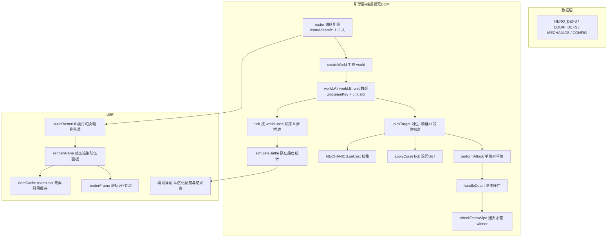

## 产品概述

将现有的「1V1 单挑」网页小游戏从固定 2 人单挑，升级为**最多 3v3 的队伍对战**（全场最多 6 名角色，每队最多 3 人）。保留原有 12 英雄、12 装备、机制结算与全部数值/文案 quirk，仅把「单单位」抽象升级为「队伍 + 编队槽位」，并让匹配编队、战斗结算、胜负判定、批量模拟与界面显示全链路正确支持 1v1 / 2v2 / 3v3。

## 核心特性

- **模式切换与编队（匹配系统 / 队伍分配）**
- 启动界面与战斗界面顶部提供 `1v1 / 2v2 / 3v3` 三档模式切换。
- 每队可增删队员（1~3 人），切换模式时自动补齐/裁剪到对应人数。
- 每位队员独立选择英雄 + 2 件装备，沿用既有装备约束（稀有装备独占、法杖限蓝条英雄、法力护符每人最多 1 件）。
- **战斗逻辑队伍化**
- 目标选择采用**对位攻击**：我方 i 号位打敌方 i 号位；对位目标阵亡则按槽位顺延到下一个存活敌人；我方槽位超出敌方人数时从敌方 1 号位开始扫描。
- 胜负判定改为**团灭判负**：一方全部队员阵亡才判负，单个队员阵亡后战斗继续。
- 手动「⚡ 攻击一次」：两队所有存活队员按编队顺序各攻击一次。
- 自动战斗、倍速、重置、固定种子可复现等既有能力保持不变。
- **界面显示**
- 战斗区改为左右两列队伍，每列按当前人数动态渲染 1~3 个角色面板，每位队员独立的血条 / 蓝条 / 技能条 / 状态徽章 / 装备标签。
- **1 号位居中，2、3 号位居两侧**；阵亡队员面板沿用灰化 + 红框样式。
- 战斗记录、回合信息、胜利横幅均改为队伍维度（如「🏆 A队 获得胜利！」）。
- **批量模拟队伍化**
- 模拟弹窗支持配置两队各 1~3 名队员，统计项改为队伍胜负 / 平均总伤害 / 平均战斗时长等。
- **规则说明更新**
- 全局规则弹窗补充 3v3 队伍规则：人数上限、对位攻击与顺延、团灭判负、编队位序。

## 技术栈

沿用现有项目栈，不引入任何框架或构建工具：

- 原生 HTML + CSS + 原生 JavaScript（IIFE 单文件 `game.js`，引擎层 `module.exports` / `window._duel` 双导出）
- 无依赖、无打包，`<script src="game.js">` 直接运行
- 浏览器环境纯前端，无后端；随机数为 `mulberry32` 确定性伪随机（固定种子可复现）

## 实现思路

核心策略是**把引擎里的「单体 A/B」抽象升级为「队伍数组 + 编队槽位」，同时保持数值结算链路逐条不变**，以最小化对已验证战斗数值的影响：

1. **世界结构改造**：`world.A` / `world.B` 由单个 unit 变为 `unit[]`；unit 新增 `teamKey`（'A'/'B'）与 `slot`（0/1/2，对应 1/2/3 号位），保留 `sideKey` 语义兼容旧代码命名。
2. **新增目标选取层**：引入 `enemyTeamKey(teamKey)` 与 `pickTarget(world, attacker)`，统一服务普攻、4 个技能 `onCast` 与诅咒 DoT，避免各处硬编码 `world[dk]`。
3. **死亡与胜负解耦**：`handleDeath` 只负责「单位阵亡 + 绝境求生判定」，新增 `checkTeamWipe(world, teamKey)` 在团灭时才写 `world.winner`，这是 3v3 能继续战斗的关键。
4. **tick 步骤从 A/B 两段改为遍历 `world.units`（A0,A1,A2,B0,B1,B2 稳定顺序）**，保证与原单挑时序一致、结果可复现；每个可能致胜的步骤后保留 `if (world.winner) return false;` 短路。
5. **UI 从「两套固定 id」改为「按 team+slot 动态生成 + DOM 引用缓存」**，面板 HTML 用模板字符串一次性生成，随后缓存元素引用，避免每帧 `getElementById`。
6. **编队状态与战斗世界分离**：`roster`（编队配置，纯数据）→ `buildWorld()` 生成 `world`；改模式/增删队员/换英雄换装备 = 改 roster 后重建世界并重置战斗态，沿用现有「换人就全重置」的既有约定（bug④修复语义）。

## 关键实现要点（防回归）

- **保留既有 quirk，不得破坏**（文件头注释已列明）：诅咒减疗作用于施法者自身、坦克面板文案、诅咒徽章显示位置、切换英雄后网格高亮不更新。
- **保留 5 处既有 bug 修复**：猎人技能伤害不二次乘算、斗篷触发条件 `hp>0 && hp<500`、暴击补偿阈值 `streak > 4`、换英雄/换装备全量重置、自动战斗清空日志。
- **诅咒目标寻址改槽位化**：`unit.curse` 由 `targetKey: 'B'` 改为 `targetTeam + targetSlot`；`applyCurseTick` 通过 `world[targetTeam][targetSlot]` 取人，目标已死仍按原逻辑 `unit.curse = null` 结束（绝境求生救回时 hp>0，继续逐跳）。
- **性能**：单帧单位数 2→6，`tick` 各步骤为 O(单位数) 常数级遍历；`attackSchedule` 仍为「冷却累加 + while 结算」，无 N+1；UI 每帧仅更新血条/蓝条/冷却条文本与宽度，静态面板走 `uiDirty` 脏标记、状态徽章走 250ms 节流，全部沿用现有机制，不额外增加全量重绘。
- **日志量控制**：3v3 单帧日志行数约为原来的 3 倍，`CONFIG.log.max` 由 80 提升到 200（仍在 `logLines.shift()` 截断逻辑内），避免关键结算被过早挤出。
- **引擎纯度**：引擎层不得触碰 DOM；`Engine` 导出对象新增 `pickTarget`、`checkTeamWipe`，`createWorld` / `simulateBattle` 入参改为队伍数组（Node 对拍脚本需同步传 `[{heroId, equipIds}]` 形式）。

## 架构设计



## 目录结构

```
c:/Users/Administrator/Desktop/1V1 单挑/
├── game.js       # [MODIFY] 主改造文件，四层结构全部涉及
│                 #  ① CONFIG: 新增 teams(maxPerTeam=3/min=1/modes)、log.max 提至 200
│                 #  ② 数据层: 不变
│                 #  ③ 引擎层: makeUnit 加 teamKey/slot；createWorld(teamA,teamB) 支持队伍数组；
│                 #     新增 enemyTeamKey / pickTarget / checkTeamWipe / toUnitArray；
│                 #     performAttack(world, attacker, defender) 改为传单位引用；
│                 #     handleDeath 解耦单体阵亡与团灭判负；
│                 #     tick 8 个步骤改为遍历 world.units（顺序 A0,A1,A2,B0,B1,B2）；
│                 #     attackSchedule 按单位调度且目标动态选取；
│                 #     MECHANICS 4 个 onCast + applyCurseTick 接入 pickTarget；
│                 #     simulateBattle(teamA, teamB) 返回队伍维度统计；
│                 #     Engine 导出同步更新
│                 #  ④ UI 层: roster 编队状态 + 模式切换 + 动态队伍面板渲染 + domCache +
│                 #     按 team/slot 的英雄选择、装备选择、tooltip 绑定、状态/血条/冷却条刷新；
│                 #     批量模拟弹窗队伍化
├── index.html    # [MODIFY] arena 改为 #teamA/.vs/#teamB 三块容器（面板由 JS 动态生成）；
│                 #  容器顶部新增 #modeGroup(1v1/2v2/3v3) 模式切换；
│                 #  simModal 两列改为 #simTeamA/#simTeamB 动态成员容器；
│                 #  启动界面标题/副标题、全局规则弹窗补充 3v3 队伍规则
└── style.css     # [MODIFY] 新增 .team/.team-header/.mode-group/.slot-btn/.slot-0|1|2(order 1号位居中)；
│                 #  .fighter-panel 由固定 width:46% 改为 flex 自适应 + .compact 紧凑排版；
│                 #  .container 宽度与 6 面板布局适配；补充队伍胜利横幅与响应式断点
```

## 关键代码结构

```javascript
// 编队配置（UI 侧纯数据）→ 世界
// roster = { mode: '3v3', A: [{heroId, equipIds:[..,..]}, x3], B: [...] }
// createWorld(roster.A, roster.B, opts) -> world

// 对位攻击 + 顺延 + 1 号位兜底（引擎层唯一取敌入口）
// pickTarget(world, attacker) -> unit | null
//   1) 同 slot 敌人存活 → 取之
//   2) 否则环形顺延 slot+1, slot+2 ... 取首个存活
//   3) 我方 slot >= 敌方人数（阵容不等）时，从敌方 1 号位(slot 0) 开始顺序扫描

// 单位身份
// unit.teamKey: 'A' | 'B'      unit.slot: 0 | 1 | 2    （0 = 1号位，UI 居中）

// 死亡与胜负解耦
// handleDeath(world, unit, killer) -> boolean   // 单体阵亡；返回战斗是否结束
// checkTeamWipe(world, teamKey)   -> boolean    // 全队 hp<=0 → world.winner = 敌方 teamKey

// 队伍化模拟返回
// simulateBattle(teamA, teamB, opts) -> {
//   winner: 'A'|'B'|'draw', time, rounds,
//   teams: { A: { survivors, dmg, crits, attacks }, B: { ... } }
// }
```

## 设计风格

沿用现有「暗色电竞 · 霓虹金蓝」风格做扩展，不推翻重做：深空蓝紫底色 + 金色高亮 + 蓝/红双阵营对抗色。新增队伍层视觉（队伍列头、槽位徽标、编队增删按钮、模式切换药丸按钮），并加入面板出现/阵亡的轻量过渡动效，保持与现有卡片、圆角、发光描边语言一致。

## 页面规划

### 1. 启动界面（改造）

- 顶部标题区：标题改为「⚔️ 英雄对战 ⚔️」，副标题「1v1 · 2v2 · 3v3 · 英雄 · 双装备 · 策略」，版本号升级为 v4.0。
- 模式选择区：三枚药丸按钮（1v1 / 2v2 / 3v3），选中态金色描边 + 外发光。
- 按钮组保持：装备大全 / 全局规则 / 模拟统计。

### 2. 战斗主界面（重点改造，单页四大区块）

- **顶部导航块**：标题 + 模式切换（1v1/2v2/3v3）+ 返回按钮；切换模式即时重建两队编队。
- **队伍对战块**：左队（蓝）、中「⚡ VS」、右队（红）。每队顶部为队伍头（队名 + 存活人数 / 总战力），下方 1~3 张角色面板。
- 位序：**1 号位居中，2 号位左、3 号位右**（CSS order 实现）；1 人时居中，2 人时 1 号位在右。
- 角色面板（每张）：槽位徽标 + 英雄下拉头像、名称、emoji、攻击/攻速/暴击/护甲/魔抗、装备标签、血条 + 数值、技能条、蓝条、状态徽章、双装备下拉、移除队员「✕」。
- 编队区底部：人数未满 3 时显示「＋ 添加队员」按钮。
- 阵亡面板：半透明灰化 + 红色描边（复用 `.dead`）。
- **控制块**：⚡ 攻击一次 / ▶ 自动战斗 / 🔄 重置 / 1x·2x·4x 倍速，保持现有排列与配色。
- **状态与记录块**：胜利横幅（🏆 A队/B队 获得胜利）、回合信息（回合数 + 两队存活人数/攻击次数/总伤害）、右侧战斗记录流（深色等宽字体，按伤害/治疗/诅咒/沉默配色）。

### 3. 队伍编队交互

- 模式切换 → 自动补齐或裁剪队员，并提示「🔄 已切换为 3v3，队伍已重编」。
- 增删队员即时重建世界与界面；英雄网格按槽位独立展开，互不干扰。
- 装备选择与 tooltip 按队员独立绑定，稀有独占等非法组合提示文案保持不变。

### 4. 批量模拟弹窗（改造）

- 左右两列「A队 / B队」，每列 1~3 行成员配置（英雄 + 装备① + 装备②）与「＋/✕」按钮。
- 下方：局数、固定种子、开始模拟、进度、结果表（A队胜/B队胜/平局/平均时长/平均总伤害等）。

## 布局与响应式

- 容器宽度沿用 1400px，6 面板时自动切换 `.compact` 紧凑排版（缩小 emoji/字号、收紧内边距），保证不溢出不换行。
- 断点 ≤820px：队伍列改为纵向堆叠，每队内部面板横向排列并可横向滚动，战斗记录区限高 250px。
- 交互细节：面板 hover 微浮起，阵亡时灰化过渡 0.3s，胜利横幅渐显，模式/槽位按钮 hover 高亮。

## 动效

面板入场淡入上移、血条宽度 0.25s 过渡（沿用）、技能就绪发光、阵亡灰化、胜利横幅渐显 + 轻微缩放，全部走 CSS transition，不使用第三方动画库。