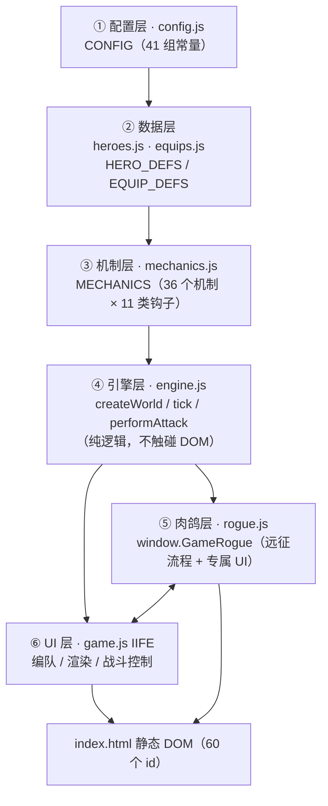
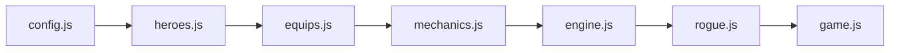
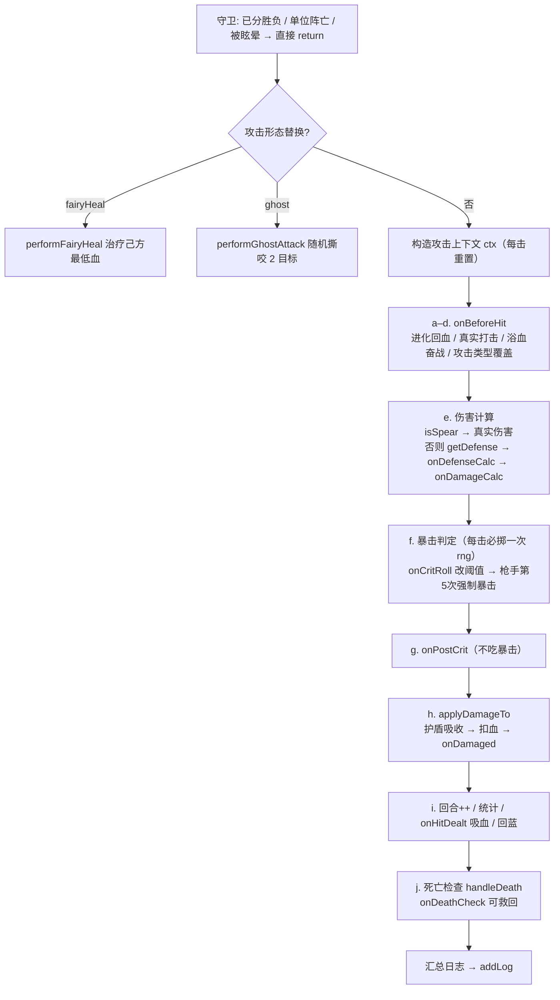
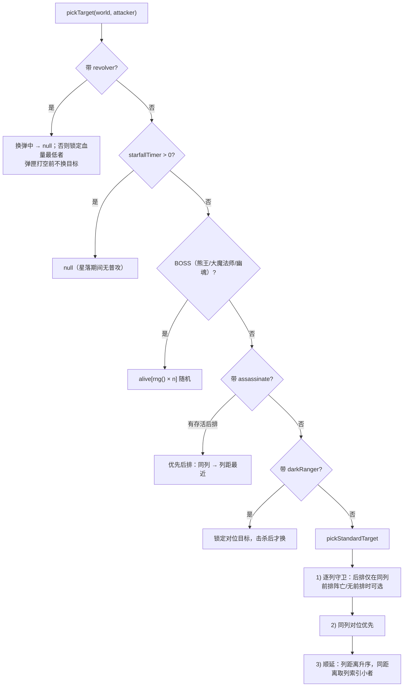
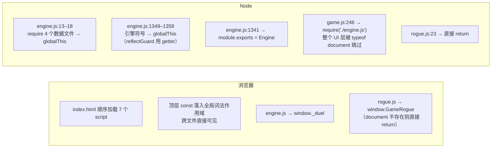

# 狂暴对战 · 远征版 · 代码结构分析

> **代码基线**：`index.html` 对外版本标注 v2.9（远征·关卡 × 难度 两层）；引擎/机制注释内部沿用 v4.x 数值版本号（如「v4.7 重做」「v2.5 新增」），两套版本号并行。
> **分析范围**：`config.js`(80) · `heroes.js`(100) · `equips.js`(134) · `mechanics.js`(1034) · `engine.js`(1359) · `rogue.js`(1328) · `game.js`(1413) · `index.html`(218) 全量展开；辅助脚本 `_smoke.html`(296) · `_tmpcheck.js`(27) · `serve-temp.js`(15) 仅登记。
> **未纳入**：`style.css`(616) 仅登记角色，不展开样式体系；`tmp-verify/`（拆分对拍临时产物）与 `.codebuddy/plans/`（3v3 重构计划）不在本次范围。
> **粒度**：架构概览级 —— 分层图、表格与要点为主，不逐函数罗列签名与副作用。
> **生成日期**：2026-09-14

---

## 目录

- [1. 文档说明](#1-文档说明)
- [2. 项目总览](#2-项目总览)
- [3. 分层架构](#3-分层架构)
- [4. 跨文件依赖与加载顺序](#4-跨文件依赖与加载顺序)
- [5. 分层详解](#5-分层详解)
  - [5.1 ① 配置层 `config.js`](#51--配置层-configjs)
  - [5.2 ② 数据层 `heroes.js` / `equips.js`](#52--数据层-heroesjs--equipsjs)
  - [5.3 ③ 机制层 `mechanics.js`](#53--机制层-mechanicsjs)
  - [5.4 ④ 引擎层 `engine.js`](#54--引擎层-enginejs)
  - [5.5 ⑤ 肉鸽层 `rogue.js`](#55--肉鸽层-roguejs)
  - [5.6 ⑥ UI 层 `game.js`](#56--ui-层-gamejs)
- [6. 关键调用链](#6-关键调用链)
- [7. `index.html` 的 id ↔ JS 映射](#7-indexhtml-的-id--js-映射)
- [8. 运行环境边界](#8-运行环境边界)
- [9. 扩展点与约定](#9-扩展点与约定)
- [附录 A. 关键锚点行号表](#附录-a-关键锚点行号表)

---

## 1. 文档说明

本文是**结构地图**，不是 API 手册。目标是让接手者几分钟内建立整体认知：代码分了几层、每层负责什么、数据从哪流到哪、想加东西该改哪里。

各节标题旁标注源码行号区间，便于直接跳转；核心符号的精确行号见[附录 A](#附录-a-关键锚点行号表)。

**关于 v1**：`狂暴战斗v1/` 是单文件版本（`game.js` 2350 行 + `CODE_ANALYSIS.md`）。v2 是 v1 的**同源拆分 + 3v3 队伍化**产物：引擎逐行一致（见 9.3 对拍约定），差异在于阵型由 1v1 扩展为 3 列 × 2 行、并新增远征肉鸽模式。

---

## 2. 项目总览

### 2.1 文件清单

| 文件 | 行数 | 角色 | 本次分析 |
| --- | --- | --- | --- |
| `index.html` | 218 | 静态 DOM 骨架 + 7 个 `<script>` 顺序加载 | 展开（第 7 节） |
| `config.js` | 80 | ① 配置层：`CONFIG` 魔法数字集中抽取 | 展开（5.1） |
| `heroes.js` | 100 | ② 数据层：`heroDef` / `HERO_DEFS` / `HERO_LIST` | 展开（5.2） |
| `equips.js` | 134 | ② 数据层：`equipDef` / `EQUIP_DEFS` / 分档工具 | 展开（5.2） |
| `mechanics.js` | 1034 | ③ 机制层：`MECHANICS` 注册表（36 个机制） | 展开（5.3） |
| `engine.js` | 1359 | ④ 引擎层：世界构建 / 推进 / 伤害 / 目标选择（无 DOM） | 展开（5.4） |
| `rogue.js` | 1328 | ⑤ 肉鸽层：远征挑战完整 UI + 流程（仅浏览器） | 展开（5.5） |
| `game.js` | 1413 | ⑥ UI 层：编队 / 渲染 / 战斗控制（仅浏览器） | 展开（5.6） |
| `style.css` | 616 | 全部样式（面板 / 阵型网格 / 血条 / 徽章 / 弹窗 / 远征） | 不展开 |
| `_smoke.html` | 296 | 冒烟测试页：注入 `window.__err` 收集器后加载同一套脚本 | 仅登记 |
| `_tmpcheck.js` | 27 | 临时数值核对脚本（Node 下 require 引擎，验证装备/双抗/小精灵日志） | 仅登记 |
| `serve-temp.js` | 15 | 临时静态服务器，监听 8123 端口，供本地预览 | 仅登记 |
| `tmp-verify/` | 5080 + 55 | 拆分前单文件快照 `old-full.js` + 新旧对拍脚本 `verify.js` | 不展开 |

### 2.2 技术特征

- **零依赖原生 JS**：无框架、无构建工具、无 `package.json`、无包管理器锁定。唯一的 Node 依赖是内置 `http` / `fs` / `path`。
- **多文件 + 全局词法作用域**：浏览器按 `<script>` 顺序加载，各文件顶层 `const` 直接落到全局词法作用域，**彼此无需 import 即可互相可见**。
- **双入口封装**：`engine.js` 为全局函数声明（可被 `require`）；`rogue.js` 与 `game.js` 各自包在 IIFE 中，靠 `window.GameRogue` / `window._duel` 交互。
- **代码即数据**：英雄、装备、机制全部以「数据对象 + 钩子函数」集中声明，引擎只做分发与调度。新增一个英雄 = 一条 `HERO_DEFS` + 一个 `MECHANICS` 条目。
- **确定性优先**：目标选取全程无随机；唯一的随机源是 `world.rng`（默认 `Math.random`，对拍时注入 `mulberry32` 固定种子）。

### 2.3 运行方式

- 浏览器直接打开 `index.html`（7 个脚本同步加载）。
- 或执行 `node serve-temp.js`，访问 `http://localhost:8123`。该文件注释已标明「预览用，验证完毕后删除」，属临时产物。
- Node 侧：`require('./game.js')` → 转发到 `require('./engine.js')`，可无 DOM 跑批量对拍。

---

## 3. 分层架构

**分层不变量**：数据流向单向 —— 配置 → 数据 → 机制 → 引擎。引擎**不得**反查 UI；UI 与肉鸽层**不得**绕过引擎直接改战斗数值。

---

## 4. 跨文件依赖与加载顺序

`index.html` 第 209–216 行的加载顺序是**唯一**的依赖声明方式（无模块系统）：

| 依赖关系 | 方向 | 说明 |
| --- | --- | --- |
| `heroes.js` / `equips.js` → `config.js` | 静态引用 | 顶层 `heroDef(...)` 时读取 `CONFIG` 数值（如 `CONFIG.bearClaw.minBaseHp`） |
| `mechanics.js` → `engine.js` | **逆向（运行时）** | 文件加载在引擎**之前**，但机制钩子内调用的 `applyDamageTo` / `pickTarget` / `tick` 等只在**运行时**求值，靠函数声明提升 + 全局词法作用域成立 |
| `engine.js` → 4 个数据文件 | 仅 Node | `require` 后把导出属性挂到 `globalThis`（engine.js:13–18） |
| `engine.js` → `mechanics.js` | 仅 Node | 反向把引擎符号挂到 `globalThis`（engine.js:1349–1358），补平模块作用域差异 |
| `game.js` → `rogue.js` | 运行时注入 | `GameRogue.install({ $, CHALLENGE_TEAMS, buildStatusHtml })`（game.js:1367） |
| `rogue.js` → `game.js` | 调用回调 | 精英战复用 `CHALLENGE_TEAMS[0]`，状态徽章复用 `buildStatusHtml` |

**关键点**：`rogue.js` **必须**在 `game.js` 之前加载 —— `game.js` 末尾立即执行 `init()`，其中调用 `GameRogue.install()`。

---

## 5. 分层详解

### 5.1 ① 配置层 `config.js`

单一 `CONFIG` 对象（第 7–75 行），按机制名分组，合计 41 个顶层键：系统类（`log` `auto` `sim` `teams` `equip` `mana`）、阵型类（`teams.maxPerTeam=3` `cols=3` `rows=2` `cells=6`，3v3 队伍化核心）、英雄机制类（`ironWill` `starfall` `lancer` `bossBear` `archmage` `darkRanger` …）、装备机制类（`cloak` `crystal` `thornMail` `bearClaw` `dualFist` `frostMark` `bloodScythe` …）、引擎通用类（`spear` `assassinate` `lastStand` `berserk` `curse` `critComp`）。末尾（78–80）为 Node 兼容导出。

**任何魔法数字都应落在这里**，这是本项目的硬约定。

### 5.2 ② 数据层 `heroes.js` / `equips.js`

两文件同构：**默认值填充函数 + 定义表 + 顺序列表 + 分组工具**。

| 文件 | 结构 | 要点 |
| --- | --- | --- |
| `heroes.js` | `heroDef()` 默认值填充（第 4–13 行）→ `HERO_DEFS`（15–92）→ `HERO_LIST`（93）→ `HERO_NAMES`（94）→ `HERO_INTRO_LIST`（96） | 17 个可选英雄 + 4 个 BOSS；BOSS 以 `isBoss: true` / `bossGrade: 'A'\|'B'` 标记 |
| `equips.js` | `equipDef()`（第 5–18 行）→ `EQUIP_DEFS`（20–97）→ `EQUIP_LIST`（100–104）→ 升级表 `EQUIP_UPGRADES`（107）→ 分档工具（113–130） | 装备**四档**：`normal`(1 点) / `special`(0 点) / `rare`(2 点) / `upgrade`(1 点)；`unique` 字段声明「同名唯一被动只生效一次」 |

**「只写差异」约定**：英雄/装备定义只写与默认值不同的字段，其余由 `heroDef` / `equipDef` 的 `Object.assign` 补齐。默认值表本身就是一份完整字段清单。

### 5.3 ③ 机制层 `mechanics.js`

文件头（第 3–19 行）用注释固化了**钩子契约**，这是理解整个战斗系统的钥匙：

| 钩子 | 时机 | 典型使用者 |
| --- | --- | --- |
| `onBeforeHit(unit, enemy, ctx, world)` | 每次普攻每一击开始 | 进化回血 / 真实打击 / 浴血奋战 / 星杖转换 / 双拳 |
| `onDefenseCalc(unit, enemy, ctx, world)` | `dmg = atk × (1 - 防御%)` 之前 | 猎人破甲 |
| `onDamageCalc(unit, enemy, ctx, world)` | 基础伤害算完后附加 | 太阳圣盾 / 暗杀 |
| `onCritRoll(unit, ctx)` | 暴击判定前改 `ctx.threshold` | 枪手暴击补偿 |
| `onPostCrit(unit, enemy, ctx, world)` | 暴击判定之后追加（不吃暴击） | 圣光打击（已随战士重做移除） |
| `onHitDealt(unit, enemy, ctx)` | 伤害结算后 | 吸血 |
| `onDamaged(unit, source, ctx, world)` | `applyDamageTo` 内、扣血之后 | 守护斗篷（**所有伤害来源共用**） |
| `onCast(unit, world)` | 满蓝且未被眩晕时 | 法师爆发 / 诅咒 / 圣光 |
| `onTick(unit, world, dt, opts)` | 世界步进 | 进化 / 圣光 / 双拳 / 水晶 |
| `onDeathCheck(unit, killer)` | `handleDeath` 中 `hp ≤ 0`，返回 `true` 表示救回 | 绝境求生 |
| `statusText(unit, world)` | UI 组装状态徽章 | 全部带状态的机制 |

`MECHANICS` 共 **36 个条目**，按写入时间分三段：

| 区间 | 内容 | 条目数 |
| --- | --- | --- |
| 20–778 | 英雄机制 + 基础装备机制 | 28（berserk 22 … bloodScythe 759） |
| 779–835 | v2.2 升级装备机制 | 4（rockHammer 783 / frostMark 790 / luckySword 810 / psionicStaff 819） |
| 836–1030 | v2.5–v2.6 新角色与新 BOSS | 4（starfall 843 / lancerStrike 891 / ghost 939 / darkRanger 983） |

> 注意：机制对象**不持有状态**，状态全部存在 `unit` 上（如 `unit.ammo` / `unit.darkStacks` / `unit.spiritCount`）。重置清单集中在 `game.js:1072 resetCombatState()`（共 69 个字段）。

### 5.4 ④ 引擎层 `engine.js`

| 区间 | 小节 | 关键符号 |
| --- | --- | --- |
| 1–18 | 文件头 + Node 兼容层 | `require` 4 个数据文件并挂 `globalThis` |
| 23–188 | 数据层残部 + v2.5/v2.7 机制辅助 | `RARE_EQUIPS` `reflectGuard`；`starfallPulse` `pickStrongestEnemy` `lancerAlone` `castMageBurst` `castLancerTripleStrike` `performGhostAttack` |
| 190–206 | **机制分发** | `hasMech` / `fireMechs` / `mechTick` |
| 208–272 | 工具与阵型 | `round1/round2` `clamp` `getDefense` `recalcSpeedMul` `spOf` `applyHealReduction`；`cellRow/cellCol/isFrontRow`；`DEFAULT_CELL_ORDER` |
| 274–365 | **目标选取** | `pickTarget` / `pickStandardTarget` / `columnFrontAlive` |
| 367–650 | 装备容量与数值 / 单位与编队构建 | `equipCost` `equipPointsUsed` `limitUpgradedEquips` `normalizeEquipIds` `applyEquips` / `makeUnit` `toTeamConfig` |
| 651–826 | **世界构建 / 伤害·控制·死亡** | `createWorld` `addLog` / `applyDamageTo` `applyStunTo` `checkTeamWipe` `handleDeath` |
| 827–980 | 技能结算与 DoT | `applyManaRefund` `notifySkillCast` `applyCurseTick` `applyEvo` `addIronStack` `castIronBreak` `castArcStorm` `performFairyHeal` |
| 981–1160 | **普攻管线 / 时间推进** | `performAttack`（a–j 十阶段） / `unitManaStep` `attackSchedule` |
| 1161–1278 | **世界步进** | `tick`（8 步时序） |
| 1280–1359 | 复现·模拟·导出 | `mulberry32` `teamStats` `simulateBattle` / `ROGUE_POTION` / `Engine` / `window._duel` / Node 全局挂载 |

### 5.5 ⑤ 肉鸽层 `rogue.js`

第 23 行 `if (typeof document === 'undefined') return;` 表明**该文件纯浏览器**——Node 下加载即空转。

| 区间 | 小节 |
| --- | --- |
| 25–30 | 待注入依赖：`$` / `CHALLENGE_TEAMS` / `buildStatusHtml` |
| 58–103 | 常量与状态：`ROGUE_SLOT_CELLS` / `ROGUE_SHOP` / `ROGUE_ITEMS` / `ROGUE_NODES` / `ROGUE_DIFFICULTIES` / `ROGUE` 状态对象 |
| 105–157 | v2.8 难度解锁与 `localStorage` 存档（`heroDuel_rogueProgress_v1`） |
| 159–214 | 随机工具 / 背包统计 / 卖装备 |
| 215–388 | **流程**：`rogueReset` → `rogueEnterNode` → `rogueAdvance` → `rogueBuildEnemies` → `rogueStartBattle` → `rogueStep`/`rogueFinishNow` → `rogueOnBattleEnd` → `rogueSettleConfirm` |
| 390–1273 | **渲染**：入口难度滚轮 / 结算 / 选英雄 / 整备 / 战斗 / 商店 / 奖励 / 装备升级 |
| 1274–1302 | `installRogueUI()` 事件绑定 + `window._rogue` 调试入口 |
| 1304–1328 | `window.GameRogue` 对外暴露 |

**7 个节点**（`ROGUE_NODES`，第 70–78 行）：
`① 出征(pick) → ② 战斗 → ③ 战斗 → ④ 商店(shop) → ⑤ 装备升级(upgrade) → ⑥ 精英战(elite) → ⑦ BOSS(boss)`

**与引擎的耦合点**：`rogueStartBattle()` 用 `createWorld(a, b, { maxPerTeam: 9, mode: 'rogue' })` —— `mode: 'rogue'` 是引擎侧唯一感知远征模式的开关；药水效果通过写 `unit.shield` / `unit.potionShieldTimer` / `unit.atk` 直接生效，其倒计时回收在 `engine.js:1210–1233`。

### 5.6 ⑥ UI 层 `game.js`

第 1–240 行是文件头注释（项目说明与更新日志）。第 241–246 行开启 IIFE 并做 Node 转发；**第 251 行 `if (typeof document !== 'undefined')` 包住整个 UI 层**——这是保证 Node 可复用引擎的关键。

| 区间 | 小节 |
| --- | --- |
| 253–289 | 全局 DOM 引用 + `roster` 编队状态 + 运行标志（`isAuto` / `rafId` / `accSim` / `speedMultiplier` / `domCache`） |
| 290–369 | 日志增量追加 `renderLogIncremental` + 装备详情浮窗（延迟显示 / 定位 / 事件绑定） |
| 370–502 | 启动界面（装备大全按档分栏 / 规则弹窗）+ 编队操作 `addMember` `removeMember` `moveMember` `updateMemberHero` `updateMemberEquip` `isValidEquipCombo` |
| 503–838 | 面板渲染：`PANEL_HTML` 模板 / 拖拽换位 / 英雄网格 / 装备下拉 |
| 839–1012 | 界面刷新：`updateBars` / `updateCdArea` / `refreshStaticPanels` / `buildStatusHtml` / `updateStatus` / `renderFrame` |
| 1013–1148 | 战斗控制与倍速：`stopAuto` / `startAuto` / `autoFrame` / `doManualRound` / `resetCombatState` / `buildWorld` / `rebuildAll` / `setSpeed` |
| 1149–1312 | 人物介绍 `renderHeroLibrary` + 挑战模式 `CHALLENGE_TEAMS` / `applyChallengeTeam` / `renderChallengeList` |
| 1313–1413 | 远征指针注释 + `init()` 全量事件绑定 + 首屏日志 + 立即调用 |

**渲染节流三级**（`renderFrame`，第 999–1011 行）：

| 频率 | 内容 | 触发条件 |
| --- | --- | --- |
| 每帧 | 血条 / 蓝条 / CD 条 / 回合数 / 胜利横幅 | 无条件 |
| 脏标记 | 静态面板（名称 / 属性 / 装备标签） | `world.uiDirty` |
| 250ms | 状态徽章 | `now - lastStatusRender >= 250` |
| 增量 | 战斗日志 | 与 `logShownCount` 比对 |

---

## 6. 关键调用链

### 6.1 一次普攻的钩子链（`performAttack`，engine.js:981–1123）

### 6.2 `tick` 的步时序（engine.js:1163–1278）

| 步 | 内容 | 可否致死 |
| --- | --- | --- |
| 1 | 眩晕倒计时（**仅禁普攻/施法**，回蓝与 CD 照常） | 否 |
| 2 | `evolution` 进化 | 否 |
| 3 | `unitManaStep` 回蓝 + 满蓝施放 | **是** |
| 4 | `swordAura` 剑气充能 | 否 |
| 5 | `dualFist` 双拳 / `revolver` 换弹计时 | 否 |
| 6 | `crystalRegen` `paladinHoly` `spiritSummon` `bossBear` `archmage` `jadeBlade` `psionicStaff` `manaBurst` `starfall` `lancerStrike` `ghost` `darkRanger` | 部分 |
| 6.5 | 远征药水倒计时到期回收 | 否 |
| 6.6 | 猎网减速到期 → `recalcSpeedMul` 重算 | 否 |
| 7 | 诅咒 DoT（逐 1s 跳，**不受眩晕/施法者死亡影响**） | **是** |
| 8 | 普攻调度：`manual` → 全员各强制攻击一次；否则 `attackSchedule` 按冷却累加 | **是** |

**遍历顺序固定为** `world.units = [A0,A1,A2,B0,B1,B2]`（`world.A.concat(world.B)`），A 队整体先于 B 队，队内按阵型格顺序。任何一步后 `world.winner` 非空即立刻 `return false`。

### 6.3 `pickTarget` 决策流（engine.js:290–365）

### 6.4 从点击「自动战斗」到一屏（game.js:1023–1062）

`startAuto()` → 按当前 `roster` **完整重建世界**（含日志清空，首行 `[0.0s] ▶ 自动战斗开始`）→ `requestAnimationFrame(autoFrame)`
→ 每帧：`realDelta = min(帧间隔, CONFIG.auto.deltaClamp)` → `accSim += realDelta × speedMultiplier` → 以 `CONFIG.auto.step = 0.05` 为固定步长循环 `tick`（上限 `maxStepsPerFrame = 40`）→ `renderFrame`。

**倍速只改变模拟速率，不改变任何数值逻辑**——这是可对拍的前提。

手动回合（`doManualRound`）走同一条 `tick`，仅 `dt = 1.0` 且 `{ manual: true }`。

### 6.5 远征一次战斗（rogue.js）

`rogueStartBattle()` → `createWorld(..., { maxPerTeam: 9, mode: 'rogue' })` → 消费勾选的药水 → `setInterval(rogueStep, 50)`
→ `rogueStep()` 每次 `tick(rogueWorld, 0.05)` × `rogueSpeed(=2)` → `rogueRenderBattle()`
→ 判定 `winner === 'A'` 或超时 `CONFIG.sim.timeout = 300` → `rogueOnBattleEnd` → 结算界面 → `rogueSettleConfirm` 发放金币/生命 → `rogueAdvance`。点「跳过」走 `rogueFinishNow()` 空转推进（`guard < 200000`）。

---

## 7. `index.html` 的 id ↔ JS 映射

`game.js` 通过 `const $ = id => document.getElementById(id)`（第 253 行）取值；`rogue.js` 用的是 `game.js` 注入的同一个 `$`。

| 分组 | id | 引用位置（JS） |
| --- | --- | --- |
| **启动界面** | `startScreen` `mainContainer` `startBtn` `backBtn` | game.js:256–257, 1328, 1332 |
| | `toggleEquipBtn` `startEquipLibrary` `startEquipList` | game.js:1339, 338, 402 |
| | `startEquipList_normal` / `_special` / `_rare` / `_upgrade` | game.js:404（按 `EQUIP_TIERS` 拼 key 动态取值） |
| **弹窗** | `rulesModal` `showRulesBtn` `rulesCloseBtn` `rulePlay` `ruleMech` | game.js:1343–1346, 1371 |
| | `heroModal` `heroOpenBtn` `heroCloseBtn` `heroCards` `bossCards` `heroListBody` `bossListBody` | game.js:1349–1355, 1189 |
| | `challengeModal` `challengeOpenBtn` `challengeCloseBtn` `challengeList` | game.js:1283, 1287, 1358–1363 |
| **远征弹窗** | `rogueModal` `rogueOpenBtn` `rogueCloseBtn` | rogue.js:1279, 1281, 1295 |
| | `rogueDiff` `rogueLives` `rogueGold` `rogueMap` `roguePhase` `rogueToast` `rogueBody` `rogueActions` | rogue.js:399–424, 946, 953 |
| **主容器** | `teamA` `teamB` `teamHeadA` `teamHeadB` | game.js:264–265, 660 |
| | `teamPanelsA` `teamPanelsB` `addBtnA` `addBtnB` | game.js:266–267, 659, 1394–1395 |
| | `btnFight` `btnAuto` `btnReset` | game.js:1381–1390 |
| | `speedGroup` `speed1x` `speed2x` `speed4x` | game.js:1146, 1391–1393 |
| | `winnerBanner` `roundInfo` `log` | game.js:261–262, 260, 295 |
| **装备浮窗** | `equipTooltip` `ttName` `ttDesc` `ttStats` | game.js:268–271, 330–341 |

**动态生成、不在 `index.html` 中的 id**（由 `rogue.js` 的模板字符串注入）：

| id | 生成位置 | 用途 |
| --- | --- | --- |
| `rogueLock` `rogueLockSel` `rogueLockSt` | rogue.js:456, 465 | v2.8 难度密码锁滚轮 |
| `rogueSideA` `rogueSideB` | rogue.js:986, 981 | 远征战斗上下双战场 |
| `rogueLog` | rogue.js:989 | 远征战斗日志（右侧固定） |

> 对比：`game.js` 的面板内部元素一律用 **class** 而非 id（`panel.querySelector('.hp-bar')` 等，第 594–624 行），避免同一 cell 在多队布局下 id 冲突。

---

## 8. 运行环境边界

| 关注点 | 处理方式 |
| --- | --- |
| 模块作用域割裂 | 双向挂 `globalThis`：引擎加载数据文件（13–18）、引擎暴露自身符号（1349–1358） |
| **可变变量的快照陷阱** | `reflectGuard` 是 `let`，必须用 `Object.defineProperty` + getter 暴露（1357–1358），否则机制钩子只能读到加载时的 `0` |
| UI 与逻辑解耦 | `engine.js` 零 DOM 依赖；所有 UI 由 `typeof document !== 'undefined'` 守卫 |
| 调试入口 | 浏览器 `window._duel`（引擎）/ `window._rogue`（远征状态与 `finishNow`）/ `window.rogueGainGold`（幸运精钢剑暴击回调） |

---

## 9. 扩展点与约定

### 9.1 三个高频修改位

| 想做的事 | 改哪里 |
| --- | --- |
| 加英雄 | `heroes.js` 加一条 `heroDef` + `HERO_LIST`；若带机制 → `mechanics.js` 加条目；数值 → `config.js` |
| 加装备 | `equips.js` 加 `equipDef` + `EQUIP_LIST`（注意 `tier` 决定装备点占用）；机制同上 |
| 调数值 | 只动 `config.js`，绝不在引擎里写死 |

### 9.2 必须遵守的约定

1. **魔法数字归 `config.js`**，数据表只写差异，引擎只做分发。
2. **状态挂 `unit`，机制对象无状态**。新增 `unit` 字段后，必须同步补进 `game.js:1072 resetCombatState()`，否则重置会残留。
3. **伤害一律走 `applyDamageTo`**（护盾 → 扣血 → `onDamaged`），否则守护斗篷、黑暗护盾、幽魂免疫期会被绕过。
4. **主动技能伤害传 `opts.skill: true`**，持续伤害跳数传 `opts.dot: true`；同一次技能事件用 `opts.event` 关联，使附带控制被同一层黑暗护盾抵消。
5. **取敌只用 `pickTarget`**，不要在机制里直接索引 `world[敌方键]`（3v3 下必须保持对位规则一致）。
6. **随机只能用 `world.rng`**，不得直接用 `Math.random`（会破坏固定种子复现）。

### 9.3 对拍与回归（拆分时留下的校验资产，均标注「用后即删」）

- `tmp-verify/old-full.js` + `verify.js`：拆分前单文件 vs 拆分后多文件，5 组编队 × 3 种子对拍**胜负/回合/用时/统计/逐行日志**。
- `_tmpcheck.js`：数值口径抽查（装备文案与实现是否一致、双抗加算、小精灵攻击日志聚合）。
- `_smoke.html`：浏览器侧冒烟，`window.__err` 收集脚本错误与资源加载失败。

### 9.4 已知的历史残留

- `serve-temp.js` / `_tmpcheck.js` / `_smoke.html` / `tmp-verify/` 均为临时产物。
- `_tmpcheck.js` 第 1 行硬编码 `C:/Users/Administrator/Desktop/狂暴战斗v1/`，**指向 v1 目录而非当前目录**，直接运行会读错基线。
- 分层编号在各文件头注释中不完全统一（`config.js` 自称「①」、`mechanics.js` 无编号），以本文第 3 节为准。

---

## 附录 A. 关键锚点行号表

| 符号 | 位置 |
| --- | --- |
| `CONFIG` | config.js:7 |
| `heroDef` / `HERO_DEFS` | heroes.js:4 / 15 |
| `equipDef` / `EQUIP_DEFS` / `EQUIP_TIERS` / `equipTierOf` | equips.js:5 / 20 / 113 / 119 |
| `MECHANICS` / 钩子契约注释 | mechanics.js:20 / 3–19 |
| `hasMech` / `fireMechs` / `mechTick` | engine.js:191 / 194 / 201 |
| `columnFrontAlive` / `pickTarget` / `pickStandardTarget` | engine.js:282 / 290 / 345 |
| `applyEquips` / `makeUnit` / `toTeamConfig` | engine.js:428 / 514 / 617 |
| `createWorld` / `addLog` | engine.js:654 / 699 |
| `applyDamageTo` / `applyStunTo` / `checkTeamWipe` / `handleDeath` | engine.js:712 / 762 / 784 / 793 |
| `applyCurseTick` / `applyEvo` / `castIronBreak` / `castArcStorm` / `performFairyHeal` | engine.js:834 / 868 / 909 / 933 / 964 |
| `performAttack` | engine.js:982 |
| `unitManaStep` / `attackSchedule` / `tick` | engine.js:1126 / 1147 / 1163 |
| `mulberry32` / `simulateBattle` | engine.js:1281 / 1306 |
| `Engine` 导出 / 机制钩子全局挂载 | engine.js:1332 / 1349–1358 |
| `roster` / `world` / `renderFrame` | game.js:276 / 281 / 999 |
| `startAuto` / `autoFrame` / `doManualRound` | game.js:1023 / 1042 / 1064 |
| `resetCombatState` / `buildWorld` / `rebuildAll` | game.js:1072 / 1107 / 1113 |
| `buildStatusHtml` / `renderHeroLibrary` / `CHALLENGE_TEAMS` / `init` | game.js:951 / 1189 / 1205 / 1321 |
| `ROGUE_NODES` / `ROGUE_DIFFICULTIES` / `ROGUE` | rogue.js:70 / 82 / 91 |
| `rogueEnterNode` / `rogueBuildEnemies` / `rogueStartBattle` / `rogueStep` | rogue.js:227 / 268 / 289 / 330 |
| `installRogueUI` / `window.GameRogue` | rogue.js:1277 / 1307 |
